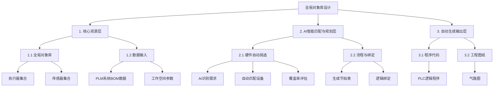

```mermaid
graph TD
    Root[全局对象库设计] --> R1[1. 核心资源层]
    Root --> R2[2. AI智能匹配与规划层]
    Root --> R3[3. 自动生成输出层]

    R1 --> R1A[1.1 全局对象库]
    R1A --> R1A1[执行器集合]
    R1A --> R1A2[传感器集合]
    R1 --> R1B[1.2 数据输入]
    R1B --> R1B1[PLM系统BOM数据]
    R1B --> R1B2[工作空间参数]

    R2 --> R2A[2.1 硬件自动挑选]
    R2A --> R2A1[AI识别需求]
    R2A --> R2A2[自动匹配设备]
    R2A --> R2A3[覆盖率评估]
    R2 --> R2B[2.2 流程与绑定]
    R2B --> R2B1[生成节拍表]
    R2B --> R2B2[逻辑绑定]

    R3 --> R3A[3.1 程序代码]
    R3A --> R3A1[PLC逻辑程序]
    R3 --> R3B[3.2 工程图纸]
    R3B --> R3B1[气路图]

```